# TDV: denoising e imágenes astronómicas

Este repositorio explora hasta dónde se puede utilizar el algoritmo de Total Deep Variation (TDV), con sus correpondientes pesos entrenados para ruido gaussiano en imágenes naturales en tareas externas; cambio de ruido, de representación de la imagen o el dominio de aplicación (imágenes astronómicas). 

Los experimentos toman de base los checkpoints gris y color de [VLOGroup/tdv](https://github.com/VLOGroup/tdv), asociados al trabajo de [Kobler et al., *Total Deep Variation for Linear Inverse Problems* (CVPR 2020)](https://arxiv.org/abs/2001.05005). Los notebooks exploran esos modelos mediante inferencia y cambios de configuración (no hay un reentrenamiento de la red como tal). Se presentó el siguiente orden de trabajo:

## 1. Variación de hiperparámetros

En [hyperparameter_sensibility.ipynb](notebooks/hyperparameter_sensibility.ipynb) se varían el ruido, el escalado de entrada, el número de pasos `S`, `T` y el peso de fidelidad `lambda`. Con la fidelidad L2 y el proximal utilizados por el checkpoint, la actualización implementada es:

$$
x_{k+1}=\frac{x_k-(T/S)\nabla R(x_k)+(\lambda/S)z}{1+\lambda/S}.
$$

En el barrido sobre `water-castle`, pasar de `S=1` a `S=10` eleva el PSNR de aproximadamente 14.0 a 32.4 dB, mientras que continuar hasta `S=30` no lo mejora. Al variar `S` con `T` y `lambda` fijos, también cambian los tamaños de paso; no se está aumentando simplemente el tiempo total de denoising. Los resultados obtenidos se condicen con lo presentado en el paper de Kobler et. al:

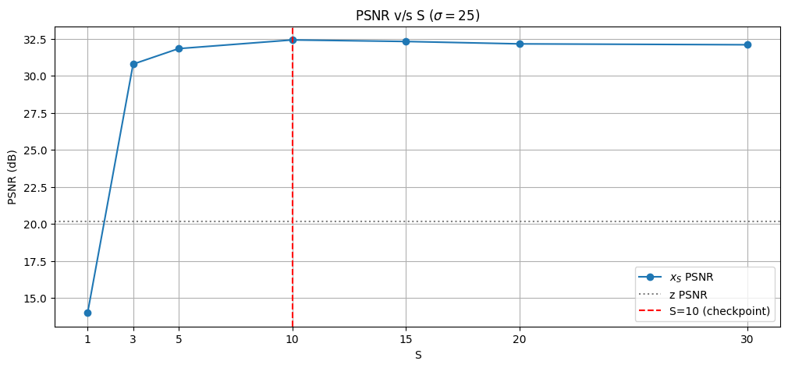

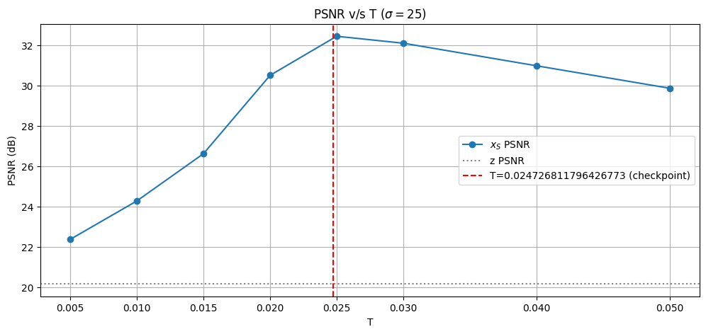

Con `lambda=0` desaparece la fidelidad, pero sigue actuando el regularizador desde la inicialización `x₀=z`. Este caso concreto conserva un PSNR de **32.43 dB**, cercano a los **32.49 dB** de `lambda=0.1` (esto lleva a la idea de que el regularizador está pudiendo trabajar por sí solo, en dado caso concreto). Esto necesita revisarse...

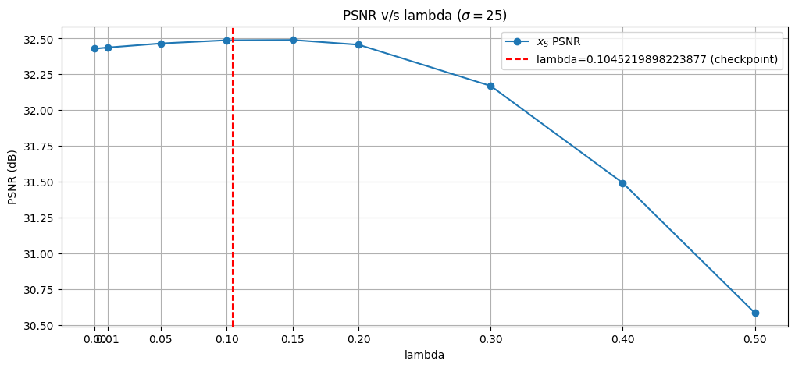

Adicionalmente, se explora la incidencia de disminuir los macroblocks en la inicialización del modelo, donde se obtuvieron resultados claramente degradados (como una especie de aproximación a $TDV_1$, $TDV_2$).

## 2. Generalización a otro tipo de ruidos 

En [noise_types.ipynb](notebooks/noise_types.ipynb) prueba ruido gaussiano, Poisson, sal y pimienta, y una combinación gaussiana–Poisson. En los barridos no gaussianos se utiliza el checkpoint original, con fidelidad L2 y `scaled=False` **inicialmente**.

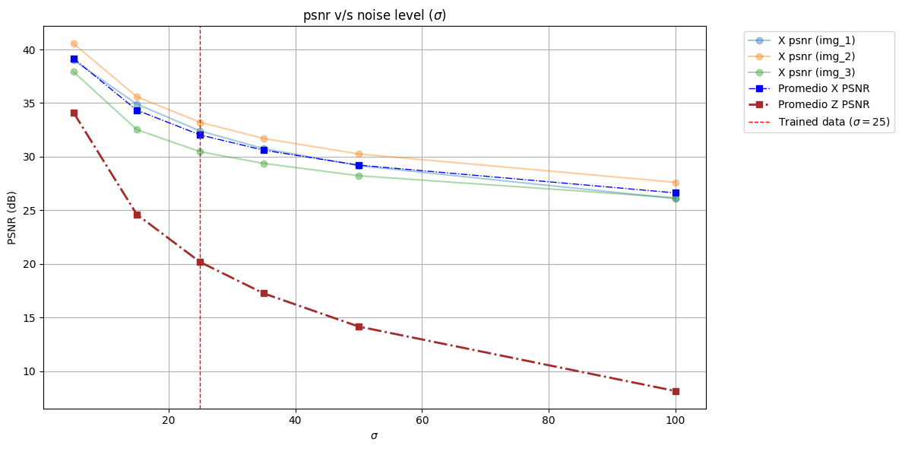

Para Poisson se genera `z = Poisson(peak · y) / peak`. donde `peak` representa el número de fotones capturados para un pixel, por tanto a mayor peak se obtiene una imagen menos degradada (No clip en esta parte). En (`peak=1000`), la curva guardada muestra que la salida puede ser peor que la entrada, un denoising "obligado" puede degradar innecesariamente.
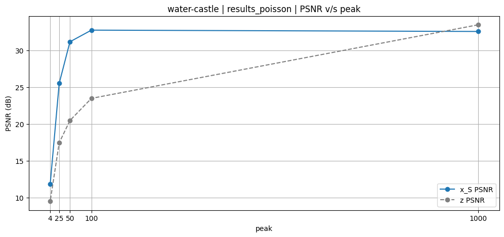

El en caso de añadir ruido de sal y pimienta el resultado es notablemente inferior a los demás casos probados. La función log-t-student, según Kobler et. al, es usada por su suavidad en el problema, no está diseñada para un ruido abrupto y aleatorio como el presentado.

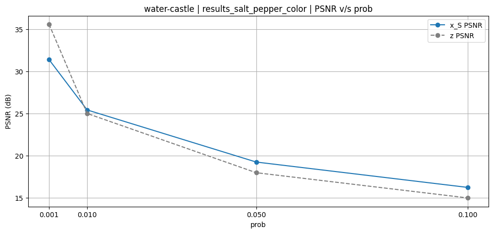

Adicionalmente, se estudió el efecto del escalado `scaled=True` (se escala la entrada por $25/\sigma_{tdv}$ y se deshace ese factor en la salida) sobre la variable $\sigma$ en el proceso de denoising de otros tipos de ruido. Los experimentos contemplaron $\sigma_{tdv} \in (5, 15, 25, 35, 50, 100)$ para cada serie de parámetros estudiado de otro ruido (por ejemplo `peaks` para ruido Poisson, o `probs` para Salt Pepper).

Los resultados obtenidos prueban que el uso del escalado con $\sigma_{tdv}$ se transfiere al nivel de degradación propiciado por el parámetro que controla el ruido concreto. Por ejemplo, para el caso de ruido Poisson, el $\sigma$ que ofrece mejor PSNR tiende a aumentar con el nivel de ruido: a peak alto (poco ruido) conviene $\sigma$ bajo (~5), a peak bajo (mucho ruido) conviene $\sigma$ alto (~100). 

**Ruido Poisson:** con `peak=1000`, $\sigma_{tdv}=5$ alcanza aproximadamente 38 dB frente a 25 dB con $\sigma_{tdv}=100$. Con `peak=5`, la relación se invierte: aproximadamente 11 dB frente a 26 dB.

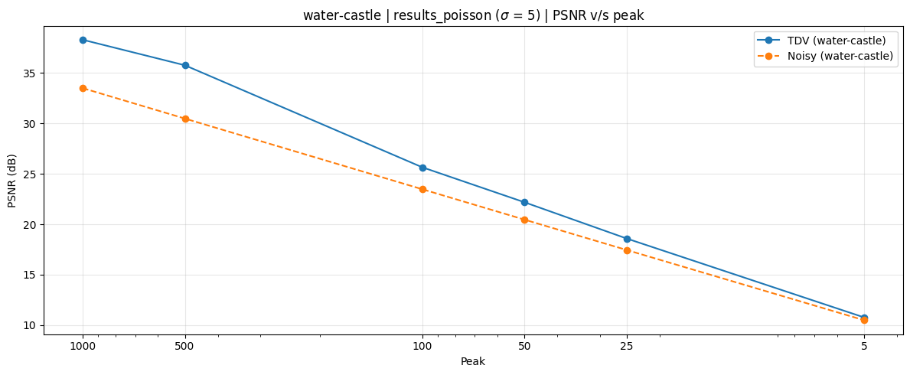
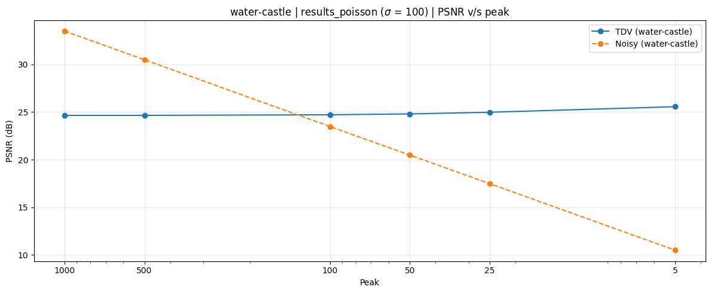

Esto mismo se observa con el ruido Salt Pepper, a pesar de ser un ruido totalmente distinto, lo que nos sugiere que el uso de `scaled=True` y su correspondiente $\sigma_{tdv}$ aplicado se puede entender como un hiperparámetro adicional, especialmente como intensidad de la regularización.

**Sal y pimienta:** con `prob=0.001`, $\sigma_{tdv}=5$ obtiene **34.65 dB**, frente a **24.66 dB** con $100$. Con `prob=0.1`, $100$ obtiene **20.06 dB**, frente a **15.13 dB** con $5$.

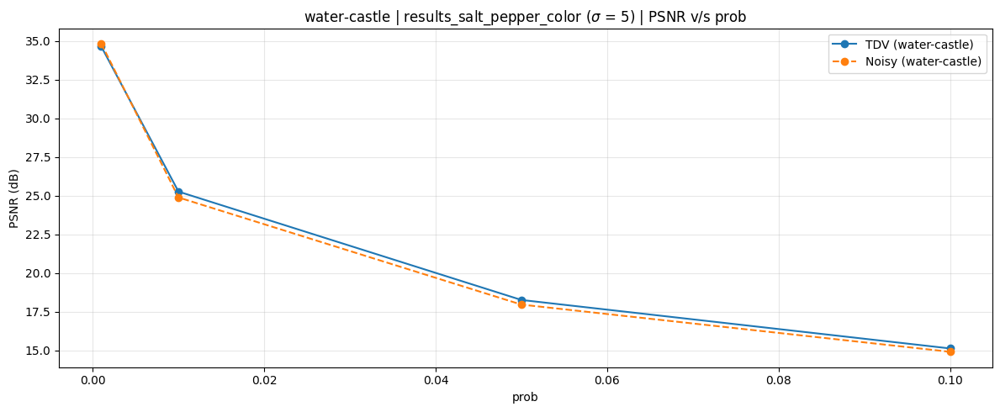

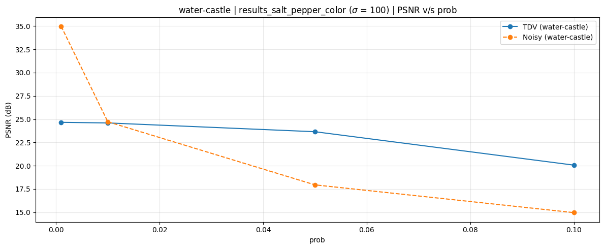

## 3. Representación de la imagen 

En [bits_depth.ipynb](notebooks/bits_depth.ipynb) se genera una única imagen ruidosa y luego se representa mediante cuantización de 4, 8 y 16 bits, conservando float32 como referencia sin cuantización adicional para TDV. Además se analiza la incidencia del clipping antes/despúes del input a la red.

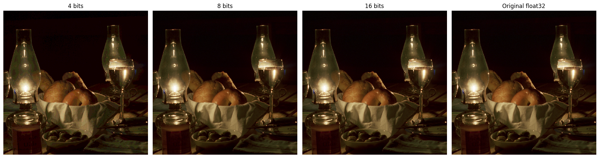

No se observó una clara ventaja en la representación de los bits a distintas profundidades, a excepción de la cuantización a 4 bits, que empeorece el resultado de las métricas.

**Cuantización a 4 bits: resultado del denoising.**

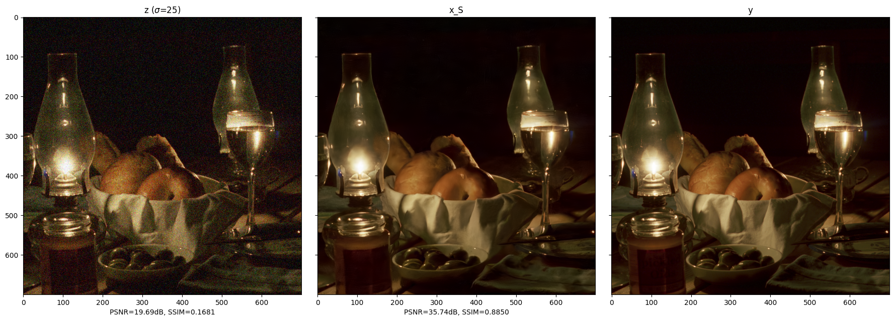

**Cuantización a 8 bits: resultado del denoising.**

**Cuantización a 8 bits: resultado del denoising.**

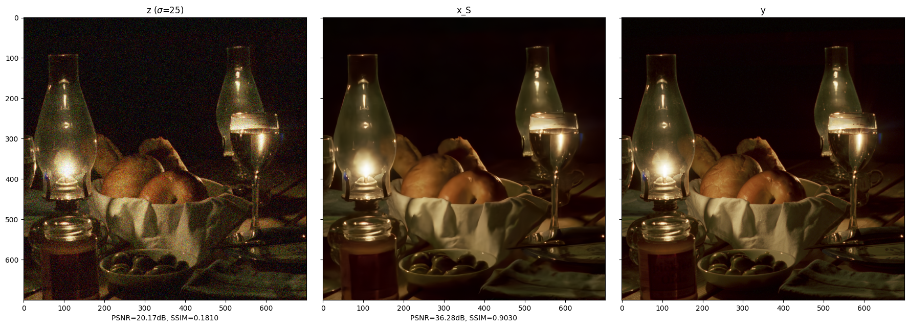

### Clipping

| Tratamiento en `water-castle` | PSNR de salida | SSIM |
|---|---:|---:|
| Sin recorte de entrada ni salida | 32.449 dB | 0.9055 |
| Recorte solo de salida | 32.464 dB | 0.9056 |
| Recorte de entrada, sin recorte de salida | 31.559 dB | 0.9023 |

Recortar la entrada a `[0,1]` mejora su PSNR antes de denoising, pero empeora la reconstrucción posterior en este ejemplo. (lo esperado era que, al tener menor ruido, debido a outliers en los pixeles, TDV rindiera mejor). La idea de estos resultados es que el recorte elimina información y deja de preservar el ruido gaussiano original, lo que dificulta la tarea de denoising al algoritmo.

## 4. Dominio astronómico

[domain_shift.ipynb](notebooks/domain_shift.ipynb) combina simulaciones, imágenes planetarias, nebulosas y observaciones con ruido real. Se analiza además, la implicancia del preprocesamiento: se aplica TDV antes y después de tres stretches.

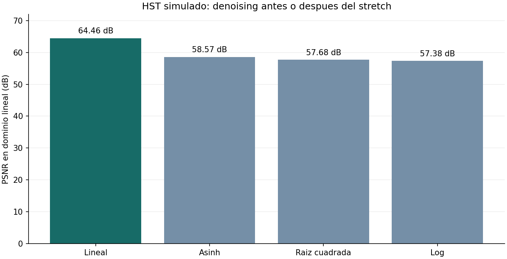

En general, TDV tiende a difuminar/borrar/extrapolar fuentes puntuales de estrellas, que se postula, a priori, confunde con ruido gaussiano.

## 5. Fotometría relativa 

[photometry_anscombe.ipynb](notebooks/photometry_anscombe.ipynb) incorpora fotometría relativa por aperturas, con posiciones detectadas en una referencia común y estimación de fondo mediante anillos (ambos métodos se usan con imagen de referencia, en dado caso, la imagen ground truth). El objetivo es comprobar conservación de flujo dentro del mismo procesamiento.

Luego de testear en diferentes archivos, teniendo en cuanta que un cociente ideal de conservación sería 1, se aprecia que al aplicar, ya sea ruido Poisson o Gaussiano, se subestima la conservación de flujo.
| Ensayo | Mediana del cociente de flujos por fuente |
|---|---:|
| M20 real: denoised / noisy | 0.946 |
| Estrellas, ruido gaussiano: noisy / referencia | 0.990 |
| Estrellas, ruido gaussiano: denoised / referencia | 0.901 |
| Estrellas, ruido Poisson: noisy / referencia | 1.006 |
| Estrellas, ruido Poisson: denoised / referencia | 0.897 |

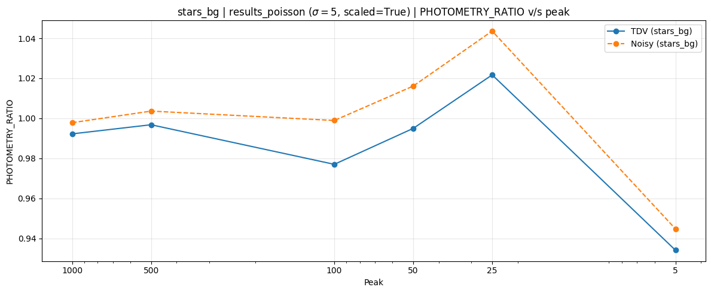

Además, se analizó el residuo del proceso de denoising; este puede tener media casi nula y aun así contener estructura correlacionada con la referencia. Lo anterior, se puede usar de explicación a la subestimación en el flujo de la imagen denoised, ya que como la fotometría relativa al ground truth no se recupera totalmente pero existe residuo aproximado nulo, quiere decir que TDV está amplificando intensidad de algunas estrellas y dismiuyendo el de otras.

## 6. Anscombe y fidelidad Poisson

Se exploran dos formas de aproximar TDV al ruido de Poisson:

- Transformada de Anscombe: Aproximar ruido poisson a gaussiano.
$$f(z) = 2 \sqrt{z + \frac{3}{8}}$$

- Fidelidad Poisson: Modelar el término de fidelidad como ruido poisson, 

$$p(z \mid x) = \prod_{i} \frac{x_i^{z_i} e^{-x_i}}{z_i!}$$

En `Final Comparison` de [photometry_anscombe.ipynb](notebooks/photometry_anscombe.ipynb) se comparan Raw Poisson + TDV con fidelidad L2, Anscombe + TDV + inversa y TDV con fidelidad Poisson, para `peak=100, 50 y 10`. La conservación de flujo difiere sustancialmente a `peak=10`. 

### stars_bg.fits

Fotometría: `fwhm=2.5`, `threshold=3`, `radius=6`; 144 de 169 fuentes tienen flujo de referencia positivo.

| Peak | Método | PSNR (dB) | SSIM |
|---:|---|---:|---:|
| 100 | Raw Poisson + L2 | 34.70 | 0.7870 |
| 100 | Anscombe + L2 | 35.99 | 0.8510 |
| 100 | Fidelidad Poisson | 35.40 | 0.8240 |
| 50 | Raw Poisson + L2 | 34.44 | 0.7817 |
| 50 | Anscombe + L2 | 34.81 | 0.8163 |
| 50 | Fidelidad Poisson | 34.73 | 0.8064 |
| 10 | Raw Poisson + L2 | 28.35 | 0.6375 |
| 10 | Anscombe + L2 | 30.83 | 0.7421 |
| 10 | Fidelidad Poisson | 18.50 | 0.0859 |

| Peak | Método | Flujo x | Mediana Fx/Fy | Media r | corr(r, y) |
|---:|---|---:|---:|---:|---:|
| 100 | Raw Poisson + L2 | 727.437645 | 0.862389 | -0.00000004 | 0.2006 |
| 100 | Anscombe + L2 | 772.284378 | 0.955806 | 0.00313504 | 0.1902 |
| 100 | Fidelidad Poisson | 743.590212 | 0.878676 | 0.00189895 | 0.1893 |
| 50 | Raw Poisson + L2 | 726.266331 | 0.841127 | -0.00000004 | 0.1519 |
| 50 | Anscombe + L2 | 764.906974 | 0.938143 | 0.00570465 | 0.1463 |
| 50 | Fidelidad Poisson | 745.165132 | 0.882110 | 0.00369749 | 0.1390 |
| 10 | Raw Poisson + L2 | 796.323527 | 0.983579 | -0.00000004 | 0.0730 |
| 10 | Anscombe + L2 | 661.460954 | 0.514275 | 0.01767249 | 0.1122 |
| 10 | Fidelidad Poisson | 953.899032 | 1.167239 | 0.06237336 | -0.2193 |

| Peak | Flujo z | Mediana Fz/Fy |
|---:|---:|---:|
| 100 | 800.511489 | 0.991798 |
| 50 | 800.503875 | 1.001563 |
| 10 | 833.929816 | 1.028360 |

### g_m110_stars.fits

Fotometría: `fwhm=2`, `threshold=10`, `radius=5`; 60 de 60 fuentes tienen flujo de referencia positivo.

| Peak | Método | PSNR (dB) | SSIM |
|---:|---|---:|---:|
| 100 | Raw Poisson + L2 | 36.37 | 0.8586 |
| 100 | Anscombe + L2 | 37.92 | 0.9024 |
| 100 | Fidelidad Poisson | 37.07 | 0.8812 |
| 50 | Raw Poisson + L2 | 35.81 | 0.8547 |
| 50 | Anscombe + L2 | 36.52 | 0.8765 |
| 50 | Fidelidad Poisson | 35.72 | 0.8563 |
| 10 | Raw Poisson + L2 | 28.37 | 0.7339 |
| 10 | Anscombe + L2 | 32.24 | 0.8202 |
| 10 | Fidelidad Poisson | 17.67 | -0.0065 |

| Peak | Método | Flujo x | Mediana Fx/Fy | Media r | corr(r, y) |
|---:|---|---:|---:|---:|---:|
| 100 | Raw Poisson + L2 | 456.140182 | 0.923857 | -0.00000004 | 0.1251 |
| 100 | Anscombe + L2 | 469.312606 | 0.966464 | 0.00298898 | 0.1034 |
| 100 | Fidelidad Poisson | 474.191035 | 0.973617 | 0.00219350 | 0.1038 |
| 50 | Raw Poisson + L2 | 444.029919 | 0.907203 | -0.00000004 | 0.0931 |
| 50 | Anscombe + L2 | 461.468703 | 0.942747 | 0.00542180 | 0.0790 |
| 50 | Fidelidad Poisson | 463.278312 | 0.941246 | 0.00435570 | 0.0661 |
| 10 | Raw Poisson + L2 | 474.711367 | 0.989016 | -0.00000004 | 0.0444 |
| 10 | Anscombe + L2 | 431.290161 | 0.870208 | 0.01537201 | 0.0887 |
| 10 | Fidelidad Poisson | 613.974722 | 1.281910 | 0.07844122 | -0.3741 |

| Peak | Flujo z | Mediana Fz/Fy |
|---:|---:|---:|
| 100 | 484.433507 | 0.996242 |
| 50 | 477.261006 | 0.994932 |
| 10 | 497.634006 | 1.048808 |

### stars_bg, peak = 100

**Raw Poisson + L2**

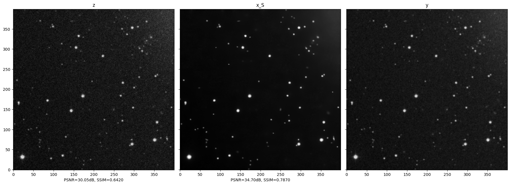

**Anscombe + L2 + inversa**

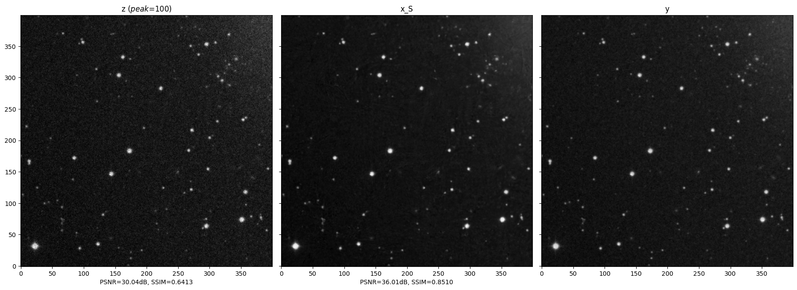

**Fidelidad Poisson**

